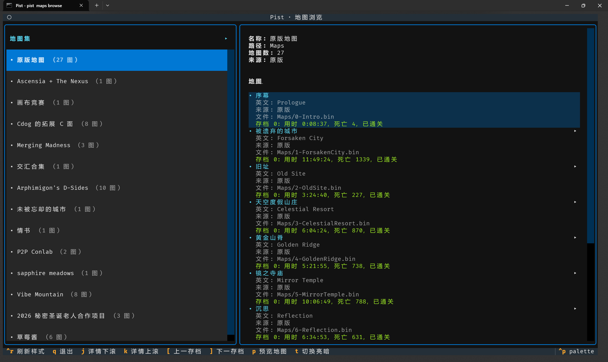
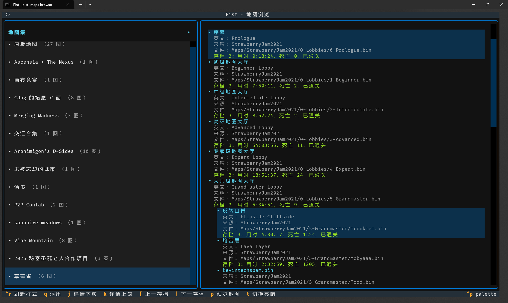
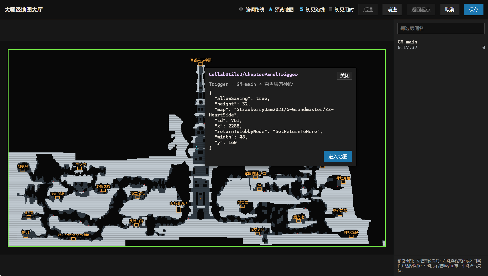
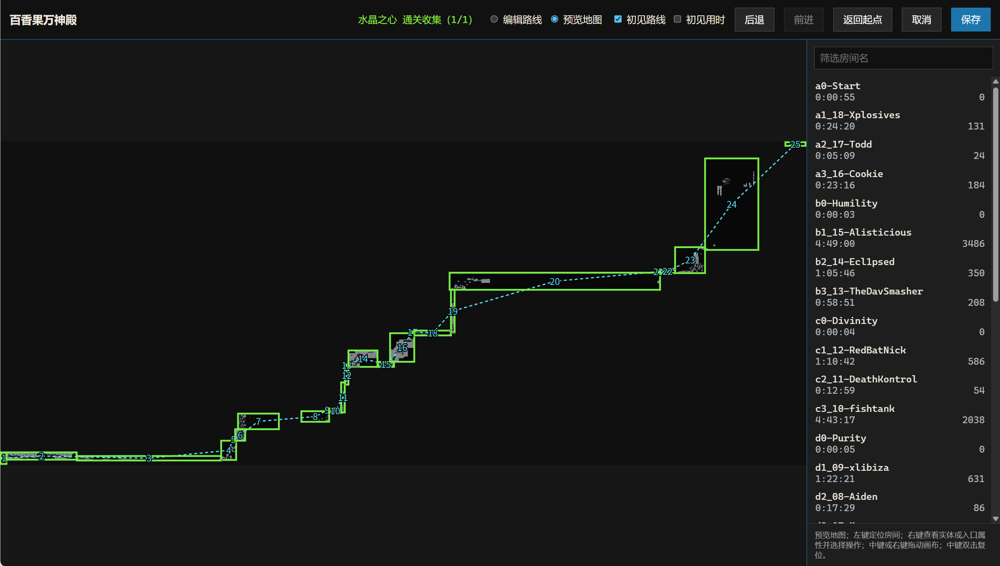

# Pist (Pig's List Manager)

用于快速记录 Celeste Mod 地图初见数据，并同步到[腾讯智能表格](https://docs.qq.com/smartsheet/DV05RU0tncXp6T1dG)。

完整变更请见[更新日志](CHANGELOG.md)。

## 界面预览

| 地图集与存档进度 | 合集大厅与投稿地图 |
| --- | --- |
| [](resources/maps_browser1.png) | [](resources/maps_browser2.png) |

| 大厅入口与地图跳转 | 初见路线与房间统计 |
| --- | --- |
| [](resources/map_preview1.png) | [](resources/map_preview2.png) |

## 主要功能

- 浏览地图日志：按游戏内地图集组织地图，支持展开合集大厅中的投稿地图，查看地图名称、存档进度、死亡数和用时。
- 预览地图：类似游戏的 Debug Map，展示房间布局，并标注规则支持的草莓、磁带与水晶之心；可叠加初见路线，查看房间或累积用时。
- 地图跳转：通过识别到的地图入口，在大厅与投稿地图等关联地图之间跳转。
- 编辑路线：校正初见路线与房间统计，用于计算地图的主房间数。
- 记录初见数据：整理用时、死亡数与可收集物统计，补充人工评价，保存到本地并同步到腾讯智能表格；支持新增或更新已有记录。
- 本地记录管理：搜索、编辑历史记录，支持单条与批量同步，不依赖地图仍安装。
- 实体审计：审查地图实体及其属性，维护用于识别可收集物的共享规则。

> 目前主要面向个人记录工作流，表格结构和统计规则带有个人定制。

## 快速开始

需要 Python 3.14+ 和 uv。在源码目录执行：

```sh
uv sync --all-packages --frozen
```

激活虚拟环境。Bash 或 zsh：

```sh
source .venv/bin/activate
```

PowerShell：

```powershell
.venv\Scripts\Activate.ps1
```

然后配置游戏目录并启动：

```sh
pist settings game-dir set <game-dir>
pist maps browse
```

同步表格前，先配置腾讯文档 API 凭证和表格地址：

```sh
pist credentials set
pist settings smartsheet-url set <sheet-url>
```

本地记录管理入口为 `pist records browse`，实体审计入口为 `pist entities audit`。命令参数可通过 `--help` 查看。

## 项目组成

`pist/` 是个人应用，`berries/` 是可复用的 Celeste 基础能力包。开发约定见 [AGENTS.md](AGENTS.md)。

## TODO

详细待办见 [TODO](docs/TODO.md)。
